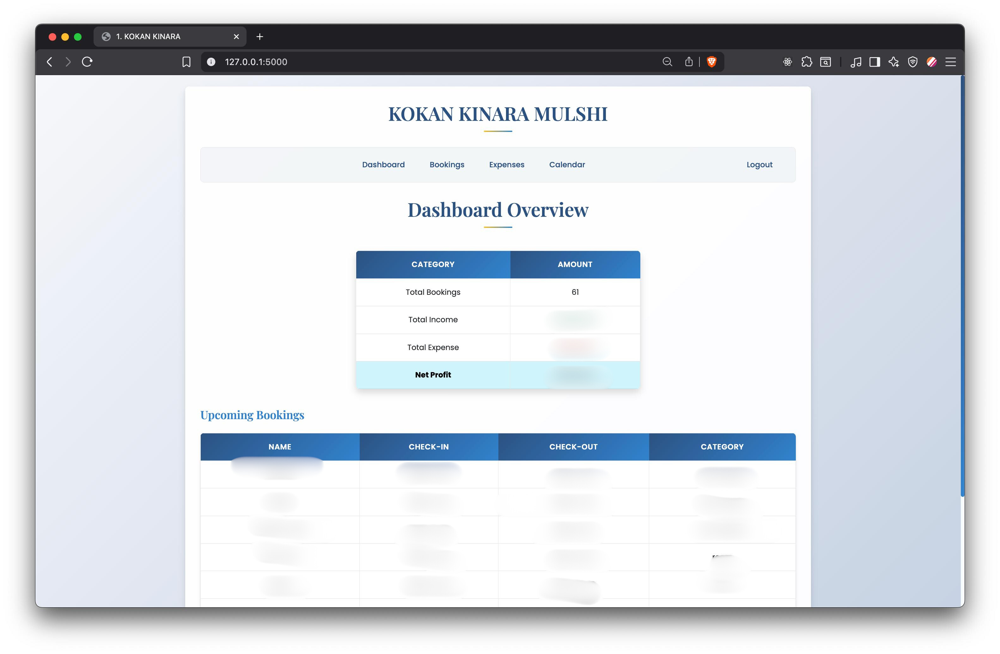
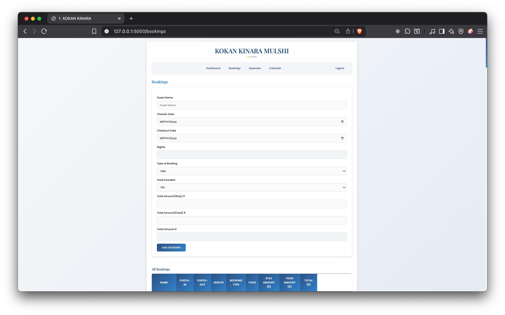
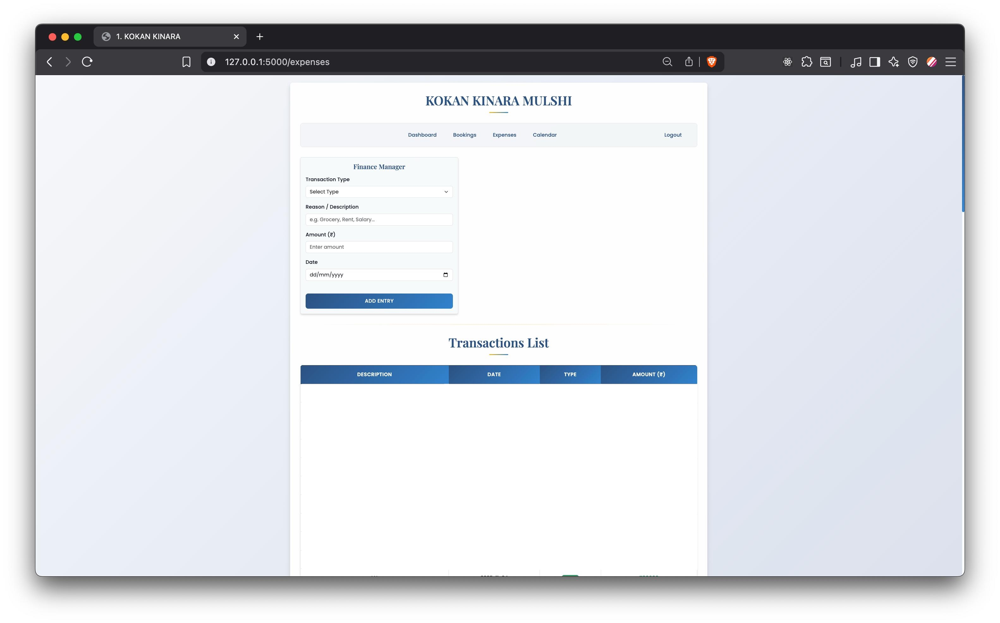
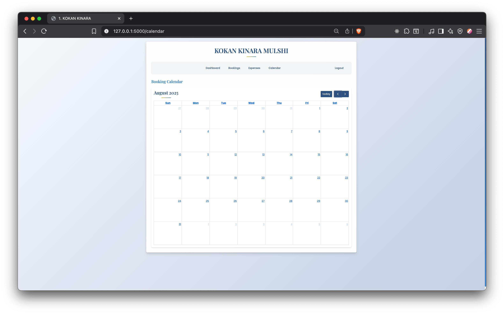
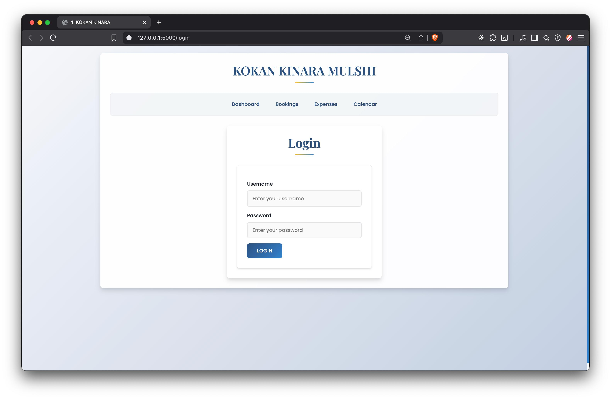

# Resort Admin Panel

A web-based **admin dashboard** built using **Flask** and **MongoDB** for managing resort bookings, expenses, and financial summaries — all in one place.

---

## Features

- Secure Login System (with password hashing)
- Booking Management (Add, view, and delete bookings)
- Expense Tracker (Log income/expenses and monitor cash flow)
- Interactive Calendar View (Visualize upcoming bookings)
- Dashboard Overview
  - Total bookings
  - Total income and expenses
  - Upcoming and latest bookings summary
- Session-based authentication using Flask sessions
- Simple & responsive admin UI (via Jinja templates)

---

## Tech Stack

| Component | Technology |
|------------|-------------|
| Backend | Flask (Python) |
| Database | MongoDB (Flask-PyMongo) |
| Templates | HTML, CSS, Jinja2 |
| Security | Werkzeug password hashing |
| Date Handling | Python `datetime` module |

---

## Screenshots

### Dashboard

### Bookings Page

### Expenses Page

### Calendar View

### Login Page

